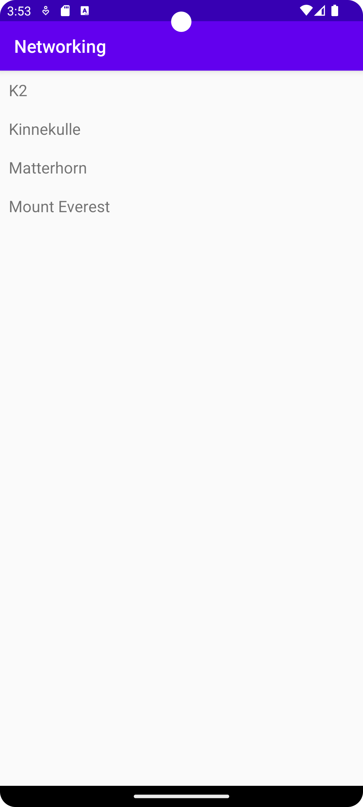

# Rapport

Jag började med att lägga till recyclerview layout-fil. Efter det aktiverade jag internet för appen via AndroidManifest.xml. Sedan lade jag till en adapter för recyclerview och skapade Java-klassen "mountain".
Efter det importerade jag och initialiserade recyclerview:n. Slutligen lade jag till en recyclerview widget, se kodexempel nedan:

```
<androidx.recyclerview.widget.RecyclerView
        android:id="@+id/recycler_view"
        android:layout_width="match_parent"
        android:layout_height="match_parent"
        app:layout_constraintBottom_toBottomOf="parent"
        app:layout_constraintEnd_toEndOf="parent"
        app:layout_constraintStart_toStartOf="parent"
        app:layout_constraintTop_toTopOf="parent" />
```

